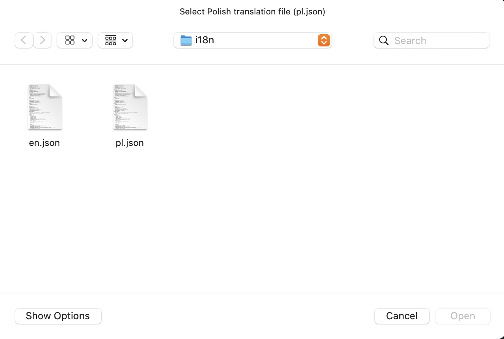

# Auto-Translate Manager

**Auto-Translate Manager** is a lightweight desktop application written in Python that helps you manage i18n JSON translation files. It allows you to:

- Load two translation files: `pl.json` (Polish) and `en.json` (English)  
- Browse existing translation keys and their corresponding texts  
- Add new translation entries  
- Automatically translate via DeepL (if enabled) or enter translations manually  
- Save updates back to both JSON files  

App is still clunky and not fully tested, but it works for basic use cases. It is very much work in progress.

---

## Table of Contents

1. [Requirements](#requirements)  
2. [Installation](#installation)  
3. [DeepL Configuration (Optional)](#deepl-configuration-optional)  
4. [Running the Application](#running-the-application)  
5. [Using the Application](#using-the-application)  
   - [Step 1: Select Polish File](#step-1-select-polish-file)  
   - [Step 2: Select English File](#step-2-select-english-file)  
   - [Step 3: Browse Translations](#step-3-browse-translations)  
   - [Step 4: Add New Translation](#step-4-add-new-translation)  
   - [Step 5: Save Changes](#step-5-save-changes)  
6. [Contributing](#contributing)  
7. [License](#license)  

---

## Requirements

- Python 3.7 or higher  
- The following Python packages (see `requirements.txt`):  
  - `tkinter` (GUI)  
  - `requests` (for DeepL API calls, if auto-translate is used)  
  - `deepl` (for DeepL API calls, if auto-translate is used)
  - `dotenv` (for loading environment variables)

---

## Installation

1. **Clone the repository**  
   ```bash
   git clone https://github.com/g0at1/auto-translate.git
   cd auto-translate
   ```
2. **(Optional) Create and activate a virtual environment**  
   ```bash
   python3 -m venv venv
   source venv/bin/activate   # macOS/Linux
   venv\Scripts\activate      # Windows
   ```
3. **Install dependencies**  
   ```bash
   pip install -r requirements.txt
   ```

---

## DeepL Configuration (Optional)

If you want to use automatic translation via the DeepL API, set your API key as an environment variable in the .env:

  ```bash
  DEEPL_API_KEY="your_deepl_api_key_here"
  ```
Without this key, the “Auto-translate to English” feature will be disabled, but you can still enter translations manually.

---

## Running the Application

From the project root directory, run:

```bash
python main.py
```

This will launch the Translation Manager GUI.

---

## Using the Application

### Step 1: Select Polish File

When prompted, choose your Polish translation file (`pl.json`) from the `i18n` folder:



### Step 2: Select English File

Next, select your English translation file (`en.json`):


### Step 3: Browse Translations

Once both files are loaded, you’ll see a tree view of all translation keys. Each key shows:

- **[PL]** – the Polish text  
- **[EN]** – the English text  


### Step 4: Add New Translation

1. Click **Add New**.  
2. Fill in the fields:
   - **Key path (dot separated)** – e.g. `HEADER.WELCOME-MESSAGE`  
   - **Polish text** – e.g. `Witamy w aplikacji!`  
   - **English text** – leave blank if you want DeepL to auto-fill  
3. (Optional) Check **Auto-translate to English** to use the DeepL API.  
4. Click **OK** to add the entry.


### Step 5: Save Changes

After making edits or additions, click **Save**.  
Both `pl.json` and `en.json` will be overwritten with your updated translations.  
You can then close the app or continue working.

## Contributing

Contributions, issues, and feature requests are welcome!  
Feel free to:

- Submit a pull request for bug fixes or enhancements  
- Open an issue to report a problem or suggest a new feature  

Please make sure your code follows the existing style and includes appropriate tests if applicable.

---

## License

This project is licensed under the MIT License.  
See the [LICENSE](LICENSE) file for details.
